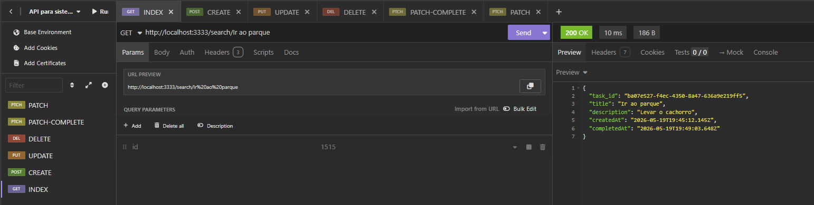
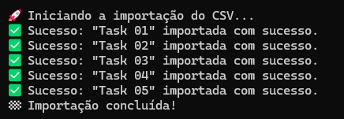

# 🚀 Task Manager API - Ignite Challenge

Uma API REST completa para gerenciamento de tarefas (CRUD), desenvolvida como o primeiro desafio prático da trilha Node.js do Ignite da Rocketseat. O projeto utiliza persistência de dados em arquivos JSON locais e conta com um script de importação massiva utilizando Streams para leitura de arquivos CSV.

## 📸 Preview

### Requisições no Insomnia


### Importação de CSV via Terminal


## 🚀 Funcionalidades

- **CRUD Completo de Tarefas**: Criação, listagem, busca inteligente (por ID ou Nome), atualização e exclusão física de tarefas.
- **Busca Híbrida**: A rota de listagem por parâmetro identifica de forma automatizada se o cliente está buscando por um ID ou pelo título exato da tarefa.
- **Validação com Zod**: Esquemas de validação estritos que limpam espaços em branco (`.trim()`) e garantem tamanhos mínimos para títulos e descrições.
- **Middlewares por Método**: Arquitetura modularizada com middlewares específicos para cada verbo HTTP (`[GET]`, `[POST]`, `[PUT]`, `[PATCH]`, `[DELETE]`), incluindo a injeção automatizada de datas nos contextos das requisições.
- **Modificação Parcial Inteligente**: Rota dedicada `/tasks/:id/complete` que atualiza apenas o estado de conclusão através do campo `completedAt`.
- **Importação via Streams**: Script assíncrono que lê um arquivo `.csv` sob demanda usando a API `fs.createReadStream` combinada com a biblioteca `csv-parse`, realizando requisições assíncronas em paralelo sem estourar o uso de memória do servidor.

## 🛠️ Tecnologias e Técnicas

- **Node.js (v20+)**: Ambiente de execução configurado com suporte nativo a ES Modules (`nodenext`).
- **TypeScript**: Tipagem estática para aumentar a segurança no fluxo de dados da aplicação.
- **Express**: Framework para controle de rotas, parâmetros e injeção de middlewares.
- **Zod**: Ferramenta de parsing e validação de esquemas de dados em tempo de execução.
- **CSV-Parse**: Biblioteca focada em Streams para o tratamento eficiente de dados tabulares.
- **File System (fs/promises)**: Módulo nativo do Node para persistência e manipulação assíncrona do arquivo local `server.json`.

## 📁 Estrutura do Projeto

Conforme a arquitetura implementada no repositório:

```text
├── src/
│   ├── assets/              # Capturas de tela para documentação
│   ├── controllers/         # Lógica de controle de requisições (TasksController)
│   ├── database/            # Camada de banco de dados baseado em arquivo (storage.ts)
│   ├── middlewares/         # Middlewares interceptadores ordenados por métodos HTTP
│   ├── routes/              # Definição e mapeamento de endpoints (taskRoutes.ts)
│   ├── types/               # Extensões globais de tipos do Express (request.d.ts)
│   └── server.ts            # Inicialização e ponto de partida do servidor Express
├── streams/                 # Script carregador e o arquivo de dados tasks.csv
├── package.json             # Scripts de execução e dependências do projeto
└── server.json              # Arquivo de persistência local ("Banco de Dados")

## ⚙️ Como Iniciar

# Clone o Repositório
git clone https://github.com/JouberthAlves/nodeJS-CRUD-TS.git

# Entre no diretório do projeto
cd nodeJS-CRUD-TS

# Instale a pasta node_modules
npm i

# Inicie os servidores
npm run dev
npm run build

# Inicie a leitura do CSV
npm run importCsv